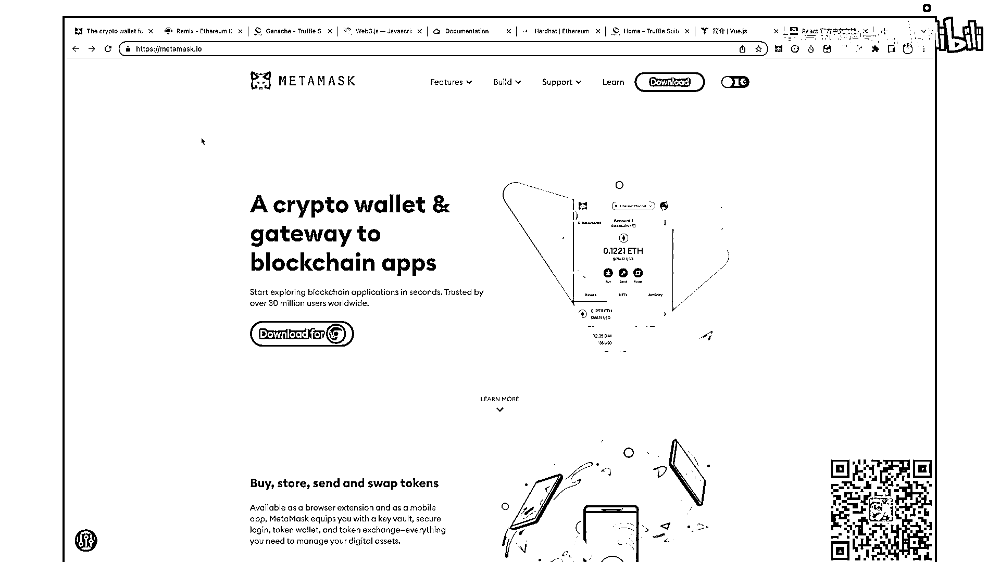
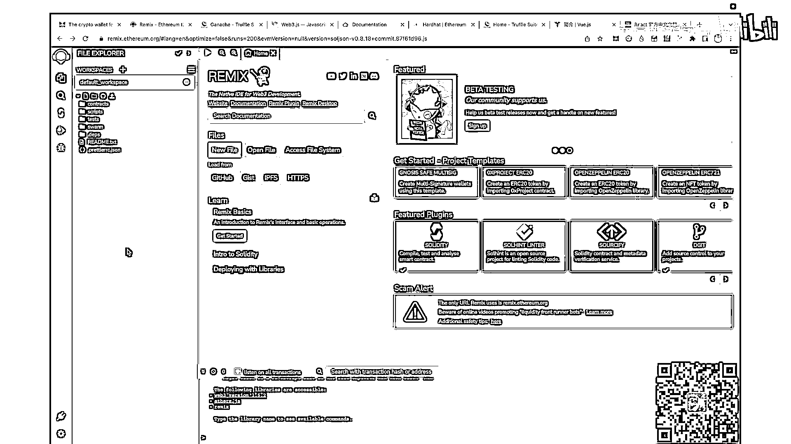
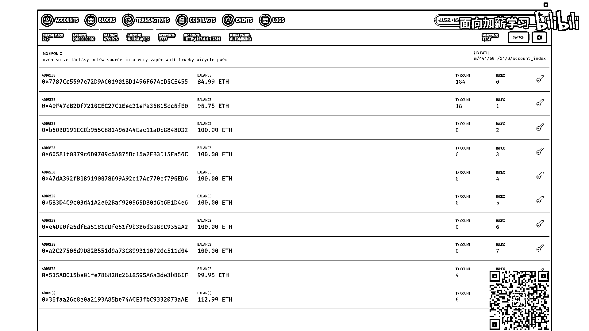
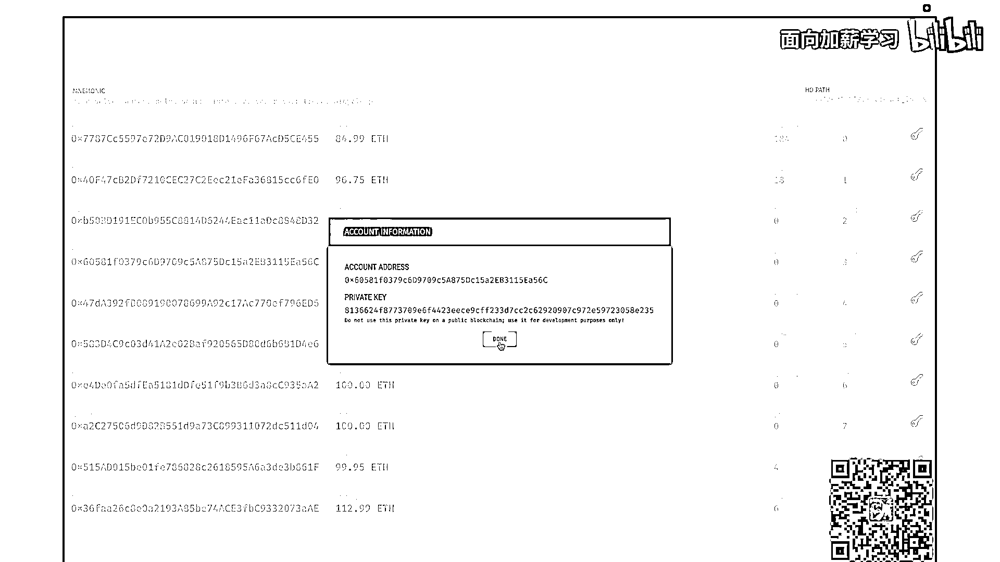
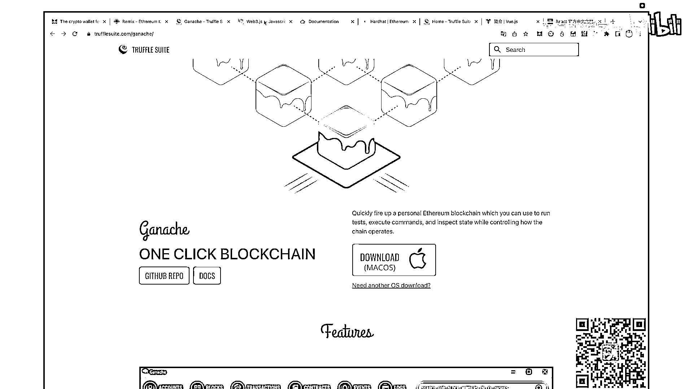
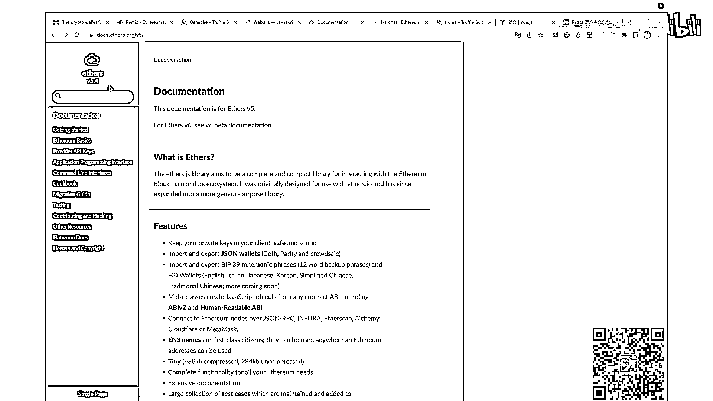
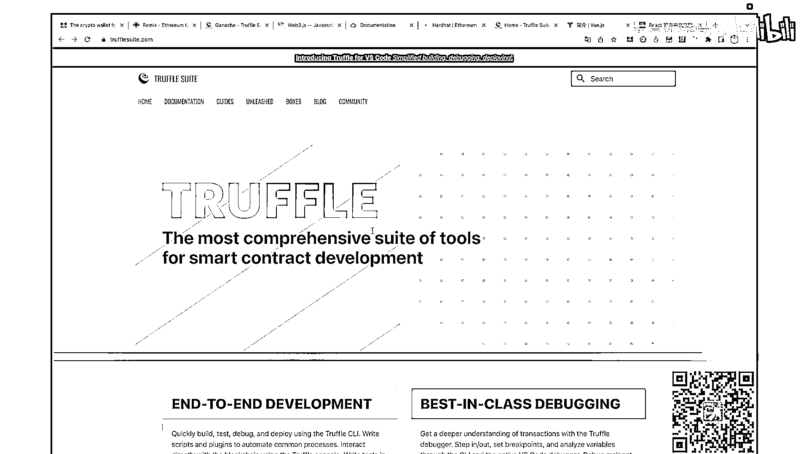
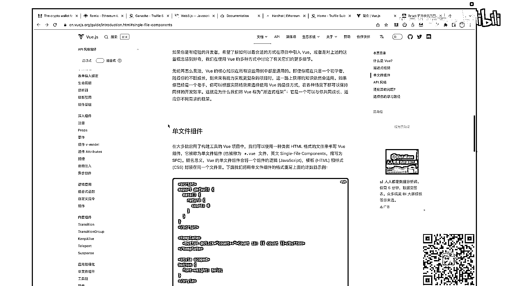
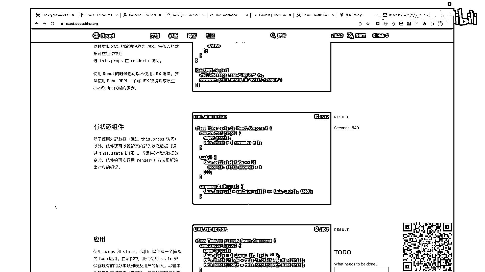

# Web3学习路线图 - P1 - 面向加薪学习 - BV1Gk4y147Ex

分享一下 web3 的学习路线图，也就是如何开发一个 D APP，我们先看一下所有的技术站，第一个我们看就是 Metamask，它就是我们说的小狐狸钱包，之前我们的视频中已经介绍过了。

它是通过钱包可以进行转账收款，还有这里面我们介绍的一些配置，最重要的是如何避坑，不让你的钱被别人坑掉，感兴趣的小伙伴可以看一下我那期的视频，还有我们说 GANASH，GANASH 是巧克力酱。

直接翻译过来就是这个意思，它的作用就是说在本地搭建一个区块链，方便我们的开发人员进行开发测试这些功能，因为我们在如果发布到正式的环境上，我们要花费真金白银，所以在本地搭建一套完整的区块链系统。

来进行测试是非常方便的，再接下来我们说这个是 Remix，是 Solidity 给我们官方新建的代码开发工具，它有在线的有本地的，如果我们是新手的话，我建议直接在 online。

也就是网页的情况下进行开发和调试，如果你使用 VS Code 或者是 Golang，比如我之前用 Go 比较多，我有 Golang 的，或者说我熟悉的任何一款你的编辑器，比如说我很熟 VS Code。

或者是其他 Atom 或者是什么的编辑器都可以，只要能写代码，把合约写出来，调试通过就 ok，我们说如果你 Remix 把合约写好以后，我们就要部署上链，这个上链我们可以部署到 GANUS 上面。

也就是我们本地的区块链上，他们 HotHead 和 Truffle 就是干这个事的，把你的合约部署到这一个区块链上，那部署好了之后，我们这边左边这三个就开始和 DAPP 有一些相关了，我们说 Web3。

js 和 Ethers。js，他们的作用是什么，是前端或者我们的 DAPP 端和我们的合约进行交互的桥梁，也就是说你在网页上的一些操作，可以通过 Ethers。js 或者 Web3。

js 进行传导你的合约上，然后你的合约执行你的代码，从而达到这个目的，我们说左边 Vue、Vue Router、Vue X 或者说 PNA，它是 Vue 前压筒，它可以构建单一页的开发，我们可以使用它。

还有一个我们也可以使用的前端应用的技术站，也就是 React 系列，目前都是 React Hooks 还有 React Router Redux，这两个对于前端的小伙伴来说是相当熟的。

因为这两个框架就是开发前端的，介绍到这里，我们就具备了 Web3D APP 开发的一个基本的能力，下面我们看一下所有这些工具的官网，它都长什么样，并且我建议大家一定要看官网，一定要看官网。

重要的事情说三遍，好我们下面到官网去，我们看到官网，第一个就是 metamask。io，Metamask 这个小狐狸，这里一定要注意钓鱼网站，它可以做一个一模一样的网站，让你下载这个钱包。

然后如果你下载了钓鱼网站或者是假的 Metamask，当你输入你的密钥的时候，它就会盗取你的密钥，然后把你的钱包里的资产全部转走，这样会给你造成重大的经济损失。

这个一定要注意。

看好这个网址避免资产受损失，第二个我们看 Remix，这个就是我们的编写智能合约的这么一个工具。

是 Solated 官网提供的，再接下来我们看 GANACH，GANACH 它就是巧克力酱，我们看黄色的下面是巧克力，它会根据你的操作系统给你一个下载，只要我们正常下载以后双击运行就OK了。

特别的简单。

我们看一下我本地运行的 GANACH，我们看它打开就是这个样子的，它给你10个账号，每一个账号是100ETH，这个对于任何一个应用我觉得都是够的，如果你说我把某些账号都花成零了，或者是非常少了。

我们还可以重新建立一个环境，然后继续使用，我们再看它这里有账号，包括这个地方的钥匙就是你的私钥，这个私钥在部署的时候是需要的。

我们可以打开看一下，比如说这个账号也就是你的公钥是什么，这个下面是你的私钥，看 don't use this private key on the public blockchain。

use it for developer purpose only，也就是说你要保护好你的私钥，不要在公共场合去给别人看你的私钥，我们现在演示这个也是 GANACH，给我们的一个账号的提示。

这个无所谓。

但是如果你真正的钱包里有资产，就不要给人家看这个私钥，还有这里头有我们的block，还有我们的transaction，还有我们的contracts，events，log。

我们看这些都有。

这个 GANACH 是非常方便的，只要双击就可以运行，再接下来我们就看 web3。js。

和 Ethers。js，目前我们说主流的一般都用 Ethers。js，之前的一些项目用 web3。js 的比较多。

这两个工具都是干一件事的，也就是连接合约和我们的 DAPP，那两个都是差不多的，他们两个干一件事，所以小伙伴只要选一个就行了。

目前比较主流的就是 Ethers。js，然后老的项目 web3。js 多一些，Ethers。js 目前比较稳定的版本是 5。4，我们也看到了，你看它的文档 v5 下面直接就挂的是5。4。

我们在练习中也会用5。4的版本。

再接下来我们看 hothead，这个就是我们部署的工具，还有我们的 truffle，同样我们现在新的项目中一般用 hothead，就像他说的扩展性还有速度都比较快。

老一点的项目就用 truffle 比较多。

再接下来我们就看 Vue 的官网，这个就是我们的前端的 web 框架。

再接下来我们看 React 的官方框架，目前还是 v18 大版本。

它会给你一些介绍，这样的话大家从官网学习，是最直接最方便的一个方式，这一小节的介绍就到这里，如果你喜欢这个视频，请一键三连。

拜拜 Peace。

