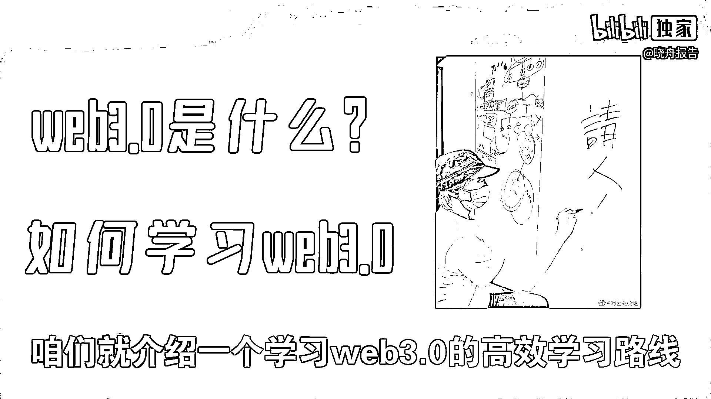
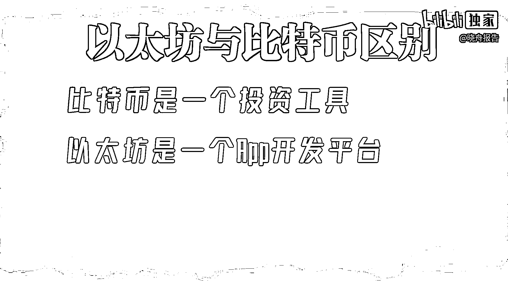

# web3.0概念科普，学习路线，推荐书籍。【晓舟报告】 - P1 - 晓舟报告 - BV1FK411U7G8

Web3这两年被提到的越来越多。

星爷前几天也发了一个招聘Web3人才的消息。

Web3到底是什么，如何学习Web3，今天咱们就介绍一个学习Web3的高效学习路线。

Web3是基于区块链技术的第三代互联网。

所以要学Web3肯定得先学区块链技术了，比如什么是区块链。

什么是比特币，区块链的原理，什么是挖矿算法，什么是以太坊，以及分叉智能合约等等这些概念。

第一次听这些东西肯定是有点懵，要解决这些问题。

找一个区块链的科普视频，肯定是不行的，所以我在B站搜索了一些适合新手学习的区块链教程。

看了一些之后，最终我找到了这个。

两小时学会区块链，我感觉还是挺适合新手入门的，大家可以看看，内容确实讲的挺好的，但是播放量不高，有点可惜了，概念学完之后，该学一些实钞的技术，毕竟咱们是学习第三代的互联网。

不写代码属实有点说不过去。

学习基于区块链的开发，肯定要先学以太访，学习的内容包括以太访平台的概念。

个人账户的创建与使用，编辑器客户端等工具的使用。

以及智能合约的编写，要学习这些内容，找科普视频肯定也是没有。

所以必须得找一个系统的教程才行，我又在B站找了一圈。

从课程安排到画面质量到音频效果到老师的表达能力，多方面对比之后。

最终找到了这个深入掌握以太访核心技术，这个视频对于大家理解以太访。

并做出一些基于以太访的应用，价值是比较大的，大家可以看一下。

这里我再做一个科普，以太访和比特币它有什么区别，比特币它是一个投资工具。

当然比特币在发明出来的时候，它是希望成为一个货币的。

可惜现在真的就只是一个投资工具了，大家说哪有货币的一天就升值几十倍。

又贬值几十倍，这货币谁敢用，以太访它是一个APP开发平台。

咱们可以举一个更容易理解以太访的例子，比如大家想开发一个微信小程序。

那咱们得依托微信的生态来编程，比如开发工具。

开发接口等等都是微信提供的，同理大家要是想开发一个去中心化的应用程序。

那就需要有一个像以太访这样的平台，来给咱们提供一些软硬件的基础设施。

这就是以太访的作用了，这也是咱们要学习以太访的原因。

说完教程再说学习Web3的推荐书籍，我给大家推荐的这本书是。

数字货币 货币革命进行时，这本书几乎没有提Web3这个词，但是讲的内容都是现在主流的Web3技术。

而且里面讲了很多案例，让大家可以更深入的理解Web3。

以及基于区块链的相关技术和应用，书中用大量的案例。

最终还得到了一个有趣的观点，我给大家分享一下，就是区块链被创造出来的时候。

初衷是有一个去中心化脱离监管，匿名安全的技术。

但是按照现在的发展进度来看，区块链想要被普及的话，那它一定是一个中心化的被监管的技术。

好像是有点背离初衷了，但是这就是现实。

那按照我的理解就是，谁干掉了中间商，谁就是最大的中间商。

谁促成了去中心化，谁就成为了新的中心，当然书中的内容不止这么一点。

干货还是非常多的，强烈建议大家读一读原著，然后再结合书中的观点。

说一说我的想法，Web3它不是Web2的替代品，而是Web2的补充。

完全的去中心化是过于理想主义的，不太容易实现，而且要实现去中心化。

它不是技术就能解决的问题，很大程度要受到人为因素的影响。

用户是不会因为Web3的概念买单的，绝大部分用户他只关心能不能用。

好不好用，身边有没有人用，不关心是否去中心化，甚至隐私安不安全都不关心。

所以Web3真的想要落地的话，那一定是巨头或者是有关部门。

强行推进才行，这样才可能实现一个，更尊重用户隐私的互联网环境。

对于咱们普通人来说，用开放的心态迎接新的技术。

用保守的心态看好自己的钱包，毕竟看好自己的钱，它要比盯着别人的钱更容易。

也更有价值，今天的内容就是这些，如果对大家有帮助，给两个币支持一下。

你的支持就是我更新最大的动力，我是小周，咱们下期再见。