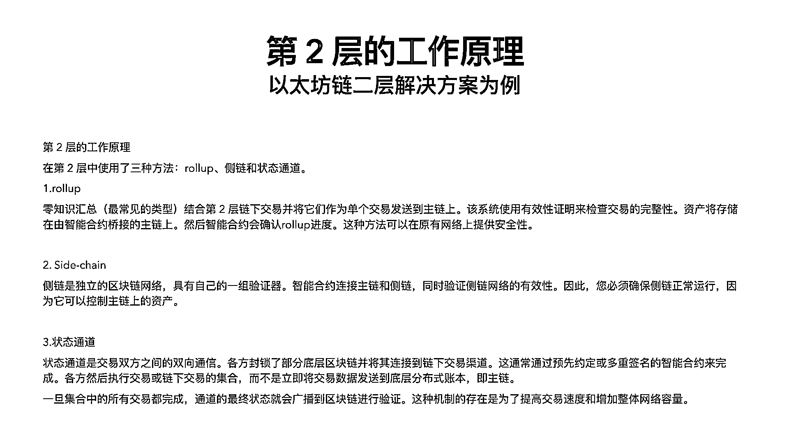

# 体系化入门Web3｜零基础入门Web3.0 - P1 - 胖虎在Web3 - BV1NM411r7P8

各位小伙伴大家好，我是庞虎，一个不正经的Web3分析师。，今天为大家带来一个系统介绍Web3知识体系的课程。，我觉得可能也算是B站第一个体系化讲解Web3的一个课程。，好，不多说，我们开始。。

本次课程由于内容比较长，我把它分为三个章节来讲解，，也就是把它拆解成了三个视频。，那么首先在第一个视频中，，本视频中我们首先会讲解Web3的概述，，初始Web3的钱包，了解什么是区块链浏览器，。

以及什么是域名系统。，那么在第二个章节中，我们会了解到支撑Web3的基础设施是什么。，我们知道传统的互联网，它的基础设施可能是服务器，，可能是域名，也可能是DNS。，那在Web3中它的基础设施是什么？。

那么就涉及到了供链，，涉及到了EVM，以及非EVM的概念，，二层网络，跨链桥，去中心化存储，以及预言机。，那么讲完了Web3的基础设施之后，，我们将可以看到Web3的生态上，，在这些基础设施之上。

它支撑起了一个怎样的生态。，那这个时候我们就会了解到DEX，稳定币，借贷平台，，以及什么是流动性质押，什么是预测市场，，以及小伙伴们比较感兴趣的GameFi，NFT，，和Web3的原生的组织。

DAO组织，分别都是什么，，这个我们到时候都会说到。，那不多说，我们开始正题。，首先我们开始第一章，Web3到底是什么，Web3的概述。，由于Web3这个其实已经并不是一个很新鲜的概念了，。

它是2022年年初就已经被广泛地提出来，，在2021年中旬就已经有的一个概念。，那么我选取了四种比较流行的，，也是比较多的大V的解读，，我引用他们的解读，以及结合个人在行业中的经验，。

总结出了四种比较流行的说法。，那么第一首先来看，我们来看第一种说法，，它是对比Web1到Web3，，首先他觉得Web1只是人们能够用阅读静态的内容，，这比较好，其实比较好理解，。

就是我们可能比较早期的互联网用户可以读到的一些文章之类的，，然后Web2是具有阅读和写的功能，，这怎么理解呢？，就是Web2就是我们现在使用的很多的APP，，包括论坛的APP也好，。

包括淘宝之类的购物类的APP也好，，我们可以发现用户实际上是可以自己读取的同时，，也可以把自己想写的功能，，想写的数据写入到APP中，，但是这些数据都是归中心化的公司所有的，。

就是好像比如说你在淘宝的购物记录，，并不是存储在你的手机中，，而是存储在这些数据公司的，，比如说阿里云的服务器之中。，那么Web3同样的也是具有读和写的功能，。

它在Web2的基础上将数据的所有权归属到了个人，，而并非是公司。，具体是怎么实现的，，我们在之后会在第二章的时候给大家讲解，，这里就先留一个小小的问号，，这是第一种说法。，那么也有一些国外的油管博主，。

我们可以看到第一上线的这张图，，我们可以看到，，它将Web1，Web2，Web3归类为，以入口的方式来进行分类。，Web1。0是需要通过username和password的方式，，进入到网络世界，。

比如说你需要输入不同的论坛中，，你需要输入不同的账号和密码。，在Web2的世界中，，你可以使用比如说统一的账号，，这里它是举的国外的例子，，但是我也可以用我们国内的例子来说一说，。

比如说现在我们在菜鸟APP上，，由于都是在阿里生态之下，，我们也可以使用淘宝的账号来登录，，也可以使用支付宝的账号来登录。，另外一种就是比如说在爱奇艺，，举个例子，在爱奇艺这个APP，。

我们也可以通过其他的社交账号，，比如说微信，比如说QQ来进行登录。，那么我们来接下来看，，那Web3是什么呢？，它是通过钱包的方式来进行统一的管理，，也就是说整个Web3的世界都使用统一的钱包账号，。

这也是为什么用户数据归用户所有的原因，，很重要的一点。，好，接下来我们也会讲解，，那么我们可以看到第三项线也有博主提出，，它是在技术的概念上将Web3和Web2做了一个对比，。

我们知道标准的Web2应用，，它是有前端、后端以及数据库，，这三种数据的一个工具，，一个功能，一个支撑。，那么Web3则是前端以及区块链，，而用户直接是用钱包跟前端进行交互，。

交互完成之后就直接进行到了区块链的这个步骤。，那么区块链跟Web3又是什么关系呢？，这个我们在之后也会衍生。，那么我们来看到最后一张图，，就是它做了一个Web1和Web2、Web3的一个表格，。

这个就比较的清晰明了，，它认为Web3实际上相较于Web2和Web1，，它是集合了区块链人工智能及其学习，，这多种技术之后形成的一个大成的产品。，这也是一种观点，，我觉得也可以参考。。

那么刚刚提到了Web3和区块链，，它们之间的关系到底是什么呢？，首先我想说的是，，由于Web3这个概念提出来这么长的时间，，由于它又是一个比较火热的赛道，，所以不同的网友，，也有很多不同的声音，。

当然同样也是有很多不同的人来认同，，所以我把这些声音，，就会搞，，让很多新用户就会，，一些新的读者啊，，或者新加入Web3的人，，他就会很困惑，，到底什么是Web3呢？，所以我在这里把它分为广义和，。

我把主流的两种声音分为广义的Web3和狭隘的Web3，，什么意思呢？，就是我们可以经常也有听到很多声音，，就是它把区块链整个生态里的一切都称为Web3，，实际上这也是有它的道理的，。

因为区块链是Web3的基础设施，，所以你将其称之为Web3也没毛病，，所以在广义的来说，，整个区块链的生态，，我们可以看到右边这张图，，任何一个生态的节点，，我们都可以将其称之为Web3的一部分，。

但是也有很多的博主，，尤其是B站的一些up主，，他们认为Web3实际上只是仅仅指的是运行在区块链上的生态应用，，而不是基础设施等部分，，那么我们在新手入门Web3的时候，。

我们可以了解到只有这两个概念就可以了，，那么我们来延伸一下，，还有一个概念我们要知道一下，，就是EVM和非EVM是什么，，我们也可以看到右边这张图，。

EVM的全称是Ethereum Virtual Machine，，以太坊虚拟机，，那么我们这样子就可以很好的了解了，，我这里还是用，，可以用一个举个不恰当的例子，，一个Github的一个示例，。

EVM链你可以理解为它是一种基于以太坊虚拟机的技术而衍生出来的链，，比如说它最早是运用在了以太坊这条链上，，之后又有很多人，，刚刚提到Github，，他们不过是fork了它的代码，。

去修改了它原来的代码，，但是也都是在最基础最原始的EVM的这个代码上进行了修改，，那么非EVM链也就非常的明了了，，因为只要不是基于最早的在EVM的Github的那个代码中去修改的，。

它就没有了EVM链。，好，刚刚提到了广义的，，也是我个人比较推崇的Web3的一个概念，，那么如果在广义的Web3来看，，它就会分为四个部分，，第一部分是区块链，，第二部分就是Crypto asset，。

第三部分是运行在区块链上的智能合约，，Smart Contract和DApp，，那么第一部分怎么理解呢？，我之后会做详细的解读，，然后第四部分是扩展性支持，，那么我们首先来看区块链，。

这个其实比较好理解的，，就是刚刚我们在介绍EVM的时候也有说到，，它就是一种替代Web2。0下巨头垄断数据的模式，，实现去中心化防篡改的一种技术，，它也是Web3能够得以运行的一个底层，。

也是承载加密资产和可编程的智能合约的平台，，那么Crypto asset是什么呢？，因为我们刚刚介绍到Web3的整个生态世界，，它都是以钱包作为入口的，，那么为什么会叫为钱包，。

是因为整个Web3的生态都是以Crypto asset的原生资产，，来承载用户的信息，，比如说我们了解到的NFT，，它本身也是一种Crypto asset，，那么智能合约是什么呢？。

它这个名字因为取得很特别，，是包括了一些金融化属性的概念，，所以会让很多的新用户混淆，，实际上你就可以理解为，，它就是可以运行在区块链上的一种编程方法，，为构成Web3应用提供了基础的支持基础，。

扩展性支持其实也非常好理解，，就是我们知道去不管是区块链世界也好，，元宇宙世界也好，，它是在它需要一种东西，，一种技术把现实之间中的，，比如说我们说股票的价格也好，，比如说现实中发生的一些新闻事件也好。

，它需要一个桥梁，，把现实之间的数据，，接入到区块链世界中，，那么那什么东西能够来实现呢？，就是扩展性支持的一些应用来实现，，比较出名的有数据的跨链桥Chainlink，。

以及区块链查询的工具The Graph，，另外一种，，接下來我們來看。

