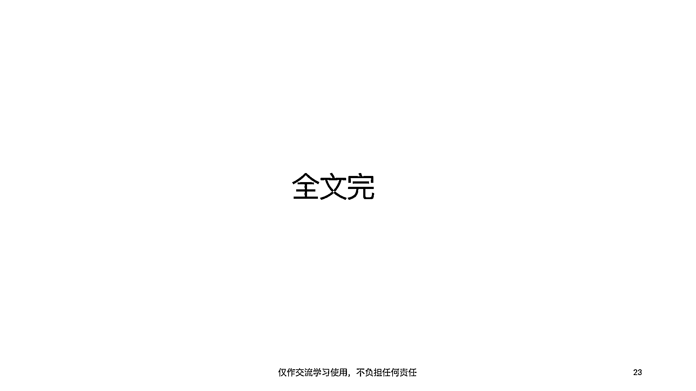

# 体系化入门Web3｜零基础入门Web3.0｜第三章 - P1 - 胖虎在Web3 - BV1me4y1L7gL

Hello 大家好，我是胖虎，我又回来了，今天我们来开始讲解Web3入门到京通的第三章，Web3的应用，OK，我们可以看到Web3的应用它主要分为，DEX。

Decentralized Exchange交易所，然后稳定币，借贷平台，流动性质押是什么，以及预测市场，然后还有我们常见的一些用例，包括GameFi，NFT和DAO，那么我们现在就开始吧。

首先要解释一下在Web3运行的一个APP，它通常会被称为DAPP，也就是全称是Decentralized Application，即去中心化应用，它是基于区块链以及其上的智能合约，运行的一个应用。

它主要讲究的，因为它是本身就运行在区块链之上的，所以它本身就具有和区块链一样的特性，包括开源去中心化以及不可篡改，那DAPP它主要是出现的不同的使用场景，在刚刚我们有提到，它大致可以分为以下几个类别。

第一种就是稳定币，第二种是去中心化的自治组织，第三种是在创作者经济中使用，第四种是去中心化金融，第五种是隐私和数字基础设施，第六种是区块链游戏以及元宇宙，那么首先来讲什么是稳定币。

首先我们知道在区块链的世界或者在web3的世界里面，我们有很多很多的虚拟货币，但是他们都不具备法定的信用和商业信用，也就是说他们的价格波幅会比较大，无法作为一般等价物。

那么稳定币就是指具有某定属性的加密货币，在与某法币或实物资产挂钩的同时，同时具有数字货币的加密交易和区块链记账的属性，那么大概有四种类型的机构或者说四种类型的稳定币。

那么我们可以看到有法定货币抵押物的稳定币，单一或多资产抵押的稳定币，也就是我们常说的算法稳定币，它通过一种激励机制驱动使其比例1比1毛币美元，但是这个机制在目前运行的其实波动还是有的。

所以它基本上也只是说接近1比1美元，那么还有另外两种，一种是权益型的稳定币，另外一种是无抵押型的算法稳定币，OK，那么什么是去中心化的组织呢，其实也全程你把它展开的话，你就会非常好的理解。

因为我们知道一个去中心化的技术模式，它必然要匹配一个去中心化的商业模式，其实DAO就是去中心化，也就是在web3的一个原生的组织。

所以就把它翻译成Decentralized Autonomous Organization，也就是说它是由代码和程序来保证它正义的这样的一个组织，那么DAO代表了一种治理方式。

它主要的要素是包括几个要素，第一是它的宗旨，第二是它的投票机制，第三是它的治理代币，第四是它的社群，第五是它的资金管理方式，那么可以看到主流的web3应用都是以DAO的形式来运行的。

那么DAO也有它自己的问题，第一我们刚刚提到DAO组织是由技术和投票的方式来进行运作，那么它就会出现一种问题，就是因为代码都是开源的，很可能DAO的发起者的编码能力就并不足够，使其代码有一定的漏洞。

导致他们出现安全问题，从而影响整个DAO组织的运作，那么另外DAO组织作为一种新的组织形式，目前仅仅还在主大部分的国家是没有被认可的，即便在美国它也是被一个中心化的机构SEC监管。

所以就很奇怪一个中心化的机构来监管一个去中心化的组织，这也是一个问题，另外也有大户操作和选民贿赂的问题，这问题怎么理解呢，我们知道DAO组织它是以它的治理代币来表达它的投票的权利。

而它的治理代币在二级市场是自由流通的，那么如果一个非常富有的大户，他希望去操纵某个决议，他实际上可以做法就是去二级市场，把大部分的治理代币全部进行一个购买的操作，这样他就拥有了很大的投票权。

这就类似于传统市场里，我们的传统金融市场里，有一些大股东为了去影响公司的决议，去二级市场收购该公司的股票，从而影响投票的结果，这样的一个问题在去中心化的世界也一样存在，那么另外呢。

有一个web3有一个很重要的一个形式，或者说应用就是NFT，非同质化代币，那它也意为不可互换的代币，具有独一无二，稀缺不可分割的属性，那么我们可以看到举了两个例子，一个是CryptoPunk。

另外一个是BorderApp YetiClub，也就是我们常说的无聊源，那么需要注意几个点，当前的NFT并不是所有的NFT的发行方都会给你NFT的版权，也就是说你购买了这个NFT。

你并不一定真正的拥有该NFT在商用方面的权利，那么这个是要非常注意的，另外呢，就是NFT其实有一种很特殊的NFT，就是ENS。

之前我们在基础设施那一块也有提到过。

以上是NFT的一个简介，然后NFT的一个价值呢，主要是目前来看的话，主要是它的艺术价值，未来有可能转换为一种金融资本。

那么接下来来讲去中心化金融，我们知道在web3的世界，所有的应用都有自己的治理代币，因为它是以道德形式来运行的，那么这就会出现一个问题，这一些治理代币之间的流通如何解决呢，那么DeFi就诞生了。

随着DeFi的发展呢，用户的需求也越来越多，我们在比如说我们在传统世界，我们在传统的金融世界拥有，就是也是有很多很多的，关于资金方面的需求，那么在去中心化的世界也是一样的，包括了借贷，包括了交易。

包括了保险，OK，这里是简单的对比一下，CFi跟DeFi的一个区别，OK，那么刚刚介绍到DeFi，那DeFi它到底是怎么运行的呢，目前主流的DeFi，也就是Top1，也可以说头部的产品，UniSwap。

我们来看一下这个UniSwap的具体用例，它是通过自动硕士商和流动性池来构建DeFi，那么传统的中心化交易所，也就是我们也可以理解为，比如说像Web2的一些金融交易所，它是通过订单部的一种方式，那么。

但是这种方式在去中心化的交易所里面，它并不能够很好的发挥作用，那，有没有一种方式可以来发挥作用呢，那就是我刚刚介绍的UniSwap使用的模式AMM，以及Liquidipool，刚刚也提到算法稳定币。

那算法稳定币它是如何保证，其与美元使用1比1的锚定的呢，这里就有介绍到，OK，接下来我这里有一张图，主要是关于在，我们知道之前也介绍过在以太坊链相关的DeFi应用，OK。

那DeFi自己本身也有很多的问题，其中也包括了区块链本身的性能不佳，智能合约技术漏洞，生态系统混乱，监管风险，无偿损失，以及无中介机构，用户直面风险等，关于区块链游戏和GameFi，其实也非常好理解。

传统的网络游戏，所有权是归游戏运营方所有，而GameFi它将所有权，真正的通过区块链的技术形式，使用户拥有了自己的游戏的资产的所有权，以下是区块链的一些用例，那么最后呢，这是关于元宇宙生态的用例。

关于元宇宙生态以及区块链游戏，它也有一些很明显的问题，第一呢，就是很难有长期的生命周期，第二，区块链的天生的可扩展性，以及速度的问题，也就是性能的问题，第三呢，游戏是工艺化的产品。

所以链游很难做到完全去中心化，四呢，游戏内容过于简单，以及五和六，厂家和玩家进入的门槛都比较高，链游团队的开发能力目前都比较弱，最后提一下创作者经济，实际上创作者经济就是将你的创意，或者文章的内容。

发布到区块链，通过区块链来证明你的知识产出，OK，以上是，嗯，本个章节的内容，也是，啊，web3从零基础到精通的全部内容，啊。

喜欢的话。

可以给我一键三连哦，谢谢观看。