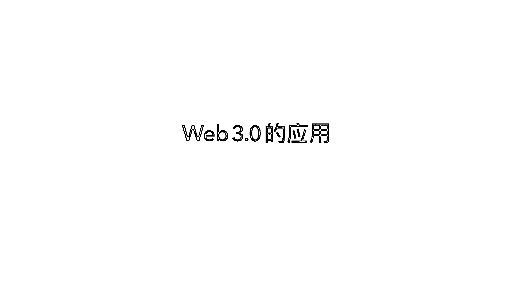

# 体系化入门Web3｜零基础入门Web3.0｜第二章——Web3的基础设施 - P1 - 胖虎在Web3 - BV1bP411K7HS

大家好，我们又见面了，我是胖虎，一个不正经的web3分析师，那么我们上一次已经讲完了web3的一个概述，那么今天呢，我会为大家带来web3的基础设施，这一个部分，这个部分呢，它首先主要包括。

web3最底层的技术，也就是我们常说的区块链攻略，然后以及区块链攻略所使用的两种技术模型，一种是EVM，一种是非EVM，然后以及为了解决早期区块链性能问题的二层网络。

以及为了连通不同的区块链之间的一种产品叫跨链桥，然后以及另外的两种基础设施，一种叫去中心化存储，一种叫预言机，好吧，那么我们现在就开始了，喜欢的小伙伴别忘了点赞评论留言，给我投币哦。

那么我们开始第二章节web3的基础设施，首先我们要了解一下区块链，web3的一个基础设施区块链，它是一种怎样的一个运行模式，我们可以看到左边的这张图，我们知道传统的互联网。

它是使用的这种中心化的一个节点的形式，而区块链则是采用的一个P2P的一个形式，数据并不是存储在专有的服务器，而是存储在每一个区块以及它的节点之中，那么节点分为全节点跟轻节点，轻节点主要是面向的是用户。

就是比如说我们普通的web3用户，它是不可能去运行一个非常重的一个完整的一个节点的，但它要怎么跟web3的网络交互呢，所以这一种就叫轻节点，全节点就是具有完整区块链数据副本功能的一个账本。

那么矿工我们常说的矿工，它就是全节点的一种，全节点通常也要承担，也就是我们传说我们常说的共识任务，共识任务是什么呢，其实也可以通俗的理解为就是矿工挖矿，挖矿的这个行为本身就是一种运行的共识任务。

那么最后呢，简单的介绍一下理想的轻节点的一种模式，这个大家了解一下就好了，那么我们之后会使用到的一个经常使用的一个钱包，也就是我们的入口的一个产品叫meta mask，但是它并不是这种理想的节点模式。

OK，接下来也需要讲到几个关键的词，以及它的这个意思，就了解一下这个术语是什么，首先我刚刚已经提到了挖矿，它就是一种全节点运行，以及保证这个网络能够区块链网络能够正常运行的一种模式。

那么gas费是我们用户在这个与区块链交互之中的一种支付给运行全节点的人的一种费用，以及共识机制其实很好理解，就是我们知道区块链网络，它是任何一个人都可以运行一个节点的，就是那这个节点的算法。

就是我们大家都认同这个算法，所以我们形成了这种共识，那这个共识抽象成一种文档也好，一种程序也好，我们就把它称为共识机制，然后主流的共识机制，你也可以理解为主流的挖矿的模式，那么它分为PoS。

 DePoS， 跟PoE 验证池，这几种方式，OK，这是随着区块链的发展也出现了一些类似于，就最早最标准的链，它一定是公有链，但是随着不同地区的政策的发展，导致出现了一些其他的链。

那我们知道一下这个分类就行了，OK，实际上这个不可能三角很好理解，就是它是可扩展性安全性已经去中心化，这三个步骤，我们本来最理想的是它都能够达成，但是以目前的技术来看，如果你想保证可扩展性。

也想保证安全性，你势必就很难实现去中心化，这个图这样看的话就很好理解了，OK，接下来介绍智能合约的部分，首先智能合约它既不智能也不是合约，智能合约是什么呢，它是英文翻译过来的。

它的全称英文叫smart contract，所以就很抽象，很直白的翻译过来就叫智能合约，它早期是，就是一种运行在区块链上的一种代码，一种可编程的货币，这种技术标准本身就叫一个智能合约。

我们可以看到最下面这一行，那么由智能合约构成的web3去中心化应用，就叫web3应用，也称为decentralized app，那么另外一种是闪电网络跟侧链，这个概念其实也很好理解。

就是早期的区块链网络，性能是很低下的，为了能够解决这样的问题，有人就提出了闪电网络跟侧链的概念，好的，以上是本第二章web3的基础设施的内容，如果你觉得有任何的疑问，也可以在评论区与我交流。

下一个章节我们将会讲到web3。0的应用，那我们下周见，再见，字幕志愿者:刘臻，欢迎订阅点赞。

謝謝觀看。