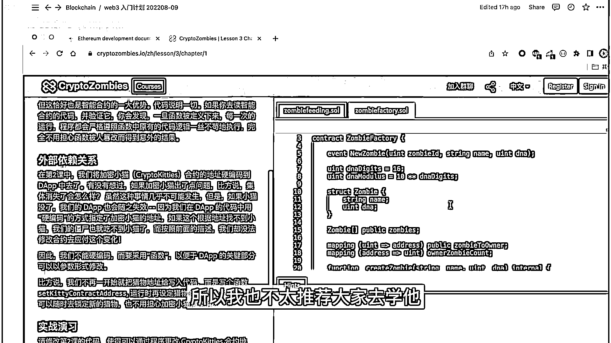
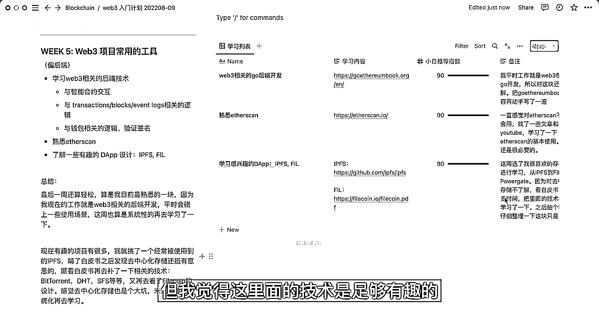

# 分享我的web3入门计划 ｜ 五周学习总结 ｜ 入门撒花 - P1 - polebug23 - BV1Je4y1r7uB

Hello，大家好，我是陈萱，卡卡。，本期视频是我对这一个多月Web3学习的总结。，感谢大家这段时间的陪伴，未来也可以持续和我交流。，本期视频比较长，我会先介绍一下我的Web3学习计划的背景。

然后是每周学了哪些内容。，首先是我个人背景的一些简单介绍。，我在今年四月份的时候从腾讯跳槽出了一家Web3公司，做的是后端开发。，我刚跳槽的时候对区块链Web3的业务是一无所知的。。

入职之后我想要系统性的学习Web3，自己搜索了很久，也请教了一些我的同事，，但结果就是没有找到非常靠谱的系统性的学习资料。，所以我在四月份入职之后一直在收集一些零零碎碎的技术点，。

在七月底的时候制定了这个为期五周的Web3学习计划，，希望可以入门的技术。，分享这个学习计划的目的主要是因为我也是一个小白，想要和别人多多交流。，这段时间也是非常地荣幸认识了非常多志同道合的朋友，。

我觉得还是一件非常开心的事情。，其次是我觉得记录自己的学习状态是能够鞭策自己更加努力一些，不要偷懒。。

好的，背景介绍就这么多，下面到本期视频的正题，我在这五周学了什么。，先给大家看看我的学习目录。，这个notion也是公开的，大家可以通过链接去访问。，首先是区块链的基础知识，然后是以太法和智能合约。。

第三周是IoT，继续学习智能合约。，第四周到了Define，第五周是Web3常用的一些工具，，以及一些我觉得有趣的DApp。，我一开始计划是需要五周，但没有想到我中途需要搬家，所以执行了六周。。

我个人的学习时间一般是在晚上的十点到十一点半，以及周末。，每周的学习时长大概是在十个小时左右。，这是我第一周学习的内容，右边是具体的学习列表。，这里的推荐指数是我按照个人喜好填的，给大家做一个参考吧。。

有一些学习内容是我觉得比较坑的，或者是不太适合小白去学。，这周的大部分时间花在看MIT区块链课程上面，，这个课我觉得还是蛮好的，对小白来说比较友好，这个老师非常喜欢提问，。

提一个问题会喊五六个人起来回答，整个课程的节奏就比较慢。，大家可以看看这里的备注。，我一共是看了第一节到第五节，涉及传统金融以及比特币白皮书里面的技术，，我觉得还是比较推荐的，讲得比较通俗易懂。

不会被劝退。，这个课之后呢，我去看了Bitcoin的白皮书，白皮书对于技术的介绍是比较精简的，，感觉自己看懂了又没有看懂，后续我会再拿出来看一看。，然后是看了精通以太坊，作为辅助阅读。

主要是学习一些概念。，第一周刚好是碰上了搬家，所以这里耽误了几天。，第二周呢，开始看以太坊和智能合约，，我通过阅读官方文档和精通以太坊来学习C-RAN相关的知识。。

这周在学Solidity上感觉走了一些弯路，，一开始是在以太坊官方文档上有看到推荐Crypto Zombies，，再加上我以前也看到过这个僵尸课程的好评，所以就去刷了。。

给你们看看它是这种游戏闯关的模式。。

我一开始觉得还挺好玩的，因为我之前没有接受过这种游戏性的教学，，但后期觉得不太行，它这种填代码的模式学得很片面和零散，，学习效率我不太满意，所以我也不太推荐大家去学它。

。

第三周是学习NFT和智能合约，，我对我这周学习效率还挺满意的，学习列表里的内容我觉得都很好。，先说NFT部分吧。，Token标准是在各个官方文档上学的，，我看了几篇讲NFT生态的文章。

挑了三个我觉得比较感兴趣的项目，，PoApp， ENS和OAV。前两个项目没有什么技术可以看的，，OAV里的技术我觉得很赞，讲的是一种新的永久存储机制，，我之前没有了解过它，看了之后觉得非常酷。。

智能合约部分，我在这周换了一种思路，，找到了一个YouTube上的课程，后续我发现这文字版的，，以及自己动手使用了一些智能合约相关的工具，Remix， HotHab这些。，这周感觉非常开心，收获满满。

而且没有踩坑。，第四周是看了DeFi和传统金融，这周就过得有点艰难了，，首先是DeFi的课程太少了，很难找到那种系统性的课程，，我一开始是看了各种官方文档，发现啥都找不到，。

最后还是我同事推荐给我的DeFi MOOC，最后是学的这个课，，我觉得还蛮好的，各种概念讲得很详细，，而且介绍了很多传统金融的知识，以及和DeFi的区别。，这周还去看了Uniswap的白皮书。

第一次看DeFi的白皮书感觉是有点劝退的，，V1还算能看懂，到了V2，V3就觉得好难啊。，感觉一周的时间看DeFi是不够的，后续我还会再来补一补。，最后一周是熟悉Web3常用的工具。

以及一些DApp的设计，，因为我现在的工作就是Web3相关的后端，平常也会有一些使用的场景，，这周算是系统性的再去学习一下Web3相关的业务逻辑，，以及easy scan的使用。，项目方面。

我选了一个我比较喜欢的存储领域，，看了IPFS和FIL白皮书。，我觉得去中心化存储还是非常有意思的，，虽然未来不一定能够有很多的应用场景，，但我觉得这里面的技术是足够有趣的。

。

今天的介绍就到这里了，如果你喜欢的话记得给我一个一键三连，拜拜！。

