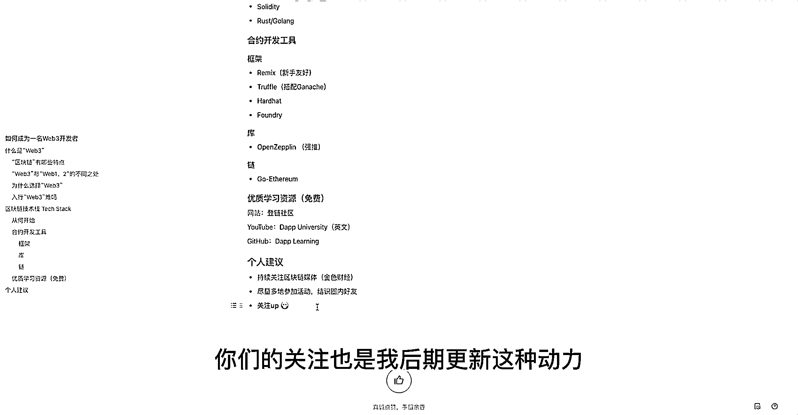

# 大学生告诉你，如何成为一名web3开发者 - P1 - Web3_Confucian - BV1Cd4y1d7xP

Hello大家好，本期视频来跟大家聊一聊如何成为一名Web3开发者，我本人是一个从事Web3行业的大学生，这期视频希望能给那些还没有进入Web3的小伙伴们带来一点帮助，让他们不再迷茫。

那么首先我们来看一下什么是Web3，百度百科上的定义是这样写的，Web3。0被用来描述互联网潜在的下一阶段，一个运行在区块链技术上的屈中英化的互联网，这上面涉及到很多的这些概念。

那么首先我们来看看核心概念区块链，那么区块链有哪些特点呢，首先它具有屈中英化，当然屈中英化是人们比较广的认可的说法，但是UP本人还是喜欢叫它为弱中英化，因为有政权，所以你没有完全的绝对的屈中英化。

但是区块链是一种弱中英化的，第二个是公开透明，区块链上的一些活动，我们称之为交易，都是公开可见的，所有人都可以看到，然后它的数据难以篡改，我们知道在互联网时代，你的数据其实就代表了一切。

那么数据非常重要，那么区块链也是让数据非常的难以被篡改，那么区块链具体是怎么一个东西，然后什么定义怎么实现，这里就不和大家质疑说，那么再者我们来看一下Web3与Web1和Web2的不同之处。

那么首先Web1，它是一个普通人只能读不能写的一种东西，比如说之前没有进入到智能手机的时代，我们只能看，然后不能写，就比如说我们可以看到网上的一些新闻，那些新闻是只有一些特殊的人可以编写发布的。

但是普通人只能阅读，只能做信息的接收者，那么Web2也就是我们现在所处的时代，它是一个普通人既能读又能写的一个东西，比如像我们现在一些代表的APP，微博知乎B站这些都是你既可以看到别人发布的东西。

然后你自己又可以做一个内容的产出者，Web3就是在Web2的基础上增加了价值因素，普通人创造的一切都具有价值，并且你的创造出的价值全部归你自己，这个可能理解起来比较难。

但是比如说像微博知乎B站这种内容创造平台，你发布自己的文章也好视频也好，它的带来的价值其实是不完全归你的，就是很大一部分价值是被平台抽走了，但是在Web3的话，你就所有的产出文章也好视频也罢。

它所产生的价值带来的一些收益就全归用户个人所有，这也是为什么好多人都在奔向Web3，那么我们为什么要选择Web3呢，首先它相对于传统互联网来说不那么卷，现在今年互联网大厂裁员浪潮肯定大家也都知道。

那么现在互联网也是非常的卷，计算机这个行业也是没有以前那么香了，所以说Web3相对于传统互联网来说还不那么卷，当然这也只是目前来看，当人们都发现这个行业的潜力的时候，肯定就越来越卷了。

然后第二点是高新远程不那么依赖于公司，这个还是说工作方面，现在Web3的行业的薪资应该是所有行业顶尖了，可以跟金融白白手腕，然后也是绝对的高于传统的互联网，那么远程是它的一个特点。

就我们知道现在疫情造成的影响，线下办公非常的头疼，但是Web3它很多公司都鼓励你远程，就是你在家就可以办公，像我现在在家，然后在和上海那边一家公司在工作远程的方式，然后不那么依赖于公司是指。

如果你成为一名Web3开发者，你自己写的代码是可以为你带来直接收益的，它不像传统互联网，你需要去接单接需求去帮人家写代码，然后人家付你佣金这样的方式，你自己写的代码可以自己就直接产生收益。

但是具体怎么直接产生收益我们后面再说，第三点的话是很有趣，确实是很有趣，如果你运气好的话，时机比如说在牛市里面就可以边学边赚，我之前也是刚入门的时候也是，发现竟然有天下掉馅饼这样的事情。

你学到了知识然后还赚到了钱，那么很多人问入行Web3难吗，其实我觉得不是特别难，因为我现在也是没有毕业一个本科大学生，然后我也能学懂，当然可能水平也不是很高，但是目前来说还是大概能懂的，基本懂得差不多。

然后只要你keep learning，就是你保持热情，然后一直的去学习，那么你其实不比那些有很多有很长的从业经验，或者是之前Web2领域的开发者，要就那么的会造成一定的这种经验上的差距。

区块链技术战有哪些，因为我们知道Web3它主要是运行在区块链之上，那么Web3开发其实主要也就是区块链的开发，那么它主要有两个方向，一个是应用开发，一个是链开发，但是我主要是做应用开发的。

所以在这里我也就仅分享一下，关于应用开发方面的看法，那么从何开始，建议是从被誉为区块链2。0的以太坊来进行切入，因为它非常的成熟，资料也特别的多，然后开发者社区特别的活跃，你学习起来难度会相对小一点。

那么我们来看一看它涉及到的一些技术战，那么首先它也是分了三个，我给它分了三个部分，就是前端后端合约，传统开发的话应该就是前端后端就没了，但是因为区块链开发的话，它要加一个支撑合约这个方向。

首先我们来看前端，前端的话首先还是必不可少的三件套，新人入门html css javascript，然后注意的是javascript的话，有一个特殊的两个库，是用来连接一会要讲到的智能合约的。

分别是web3js和easrjs，前端的话除了我们三件套以外，还要看一下web的框架，来帮助你更好地实现你的页面，因为主要是react和view两框架，那么这里的话我个人比较推荐react。

因为我玩过大大小小很多的项目，一些牛逼的项目都用的是react，然后view特别少，所以不过我个人react能看懂，但不怎么写view是完全不会，所以我也不好说这两个哪个更好。

但是大多数人还是推崇的是react，那么后端就是一些我们web2，还是比较熟悉的东西，golang的话是在近几年都是比较主流的一个，不管是写链还是做后端都是golang与主流。

包括你看市面上现在大部分也是招聘需求也是golang，java就不多说了，很长时间的把主地位，rost是一个比较新的语言，它是也正在成为一个圈链，这个项目开发不管是应用还是后端还是链的一个趋势。

然后nodejs的话，我不确定是不是应该放到后端，反正它是跑在服务器上的，nodejs，然后看一下特殊的智能合约，智能合约的话首先还是强推3dt，这个是EVM通用的语言，很成熟，现在版本都0。8年级。

这名语言比较好学，如果你学过javascript的话，你上手3dt应该很快，然后它里面特点是涉及到一些圈链的一些独立的一些概念，比如说地址账户，然后gas这些东西，然后就是rost的话。

它也是逐渐的在成为一个，逐渐的在占据合约语言的一个市场，就越来越多的非EVM架构的链出来，他们都是不用的，不是用EVM做他们的讯集，然后他们用的是rost语言，然后做他们的合约语言。

比如说一些比较火的主流的链，像solana，boca这些网者都是用的rost，然后rost它凭借它的高效，特别是安全的特点，也是正在引起人们的重视，然后还有一些比较创新的这种合约语言。

他们是吸取了一些这种像go，java，rost这种传统语言的一些经验，然后创建出来一种独特的专门用于合约的开发的一种语言，那就是moo的话是最近比较火，因为aptos和swe那条链。

那就是moo它也是前Facebook，就是现在meta里面的大佬，然后所开发出来的，用于实现智能合约的一种语言，然后它是基于rost改的，还有一个kendency，这个是国内的一个国产公司链。

那个follow链，用的是kendency，然后还有py2，py2的话主要是aggron条链，也是基于python改的，那么这个隧道图大概就这样，他们隧道一些编程语言。

那么我个人推荐的是这三种或四种语言，首先是javascript，这个不管你搞不搞区块链，其实都挺值得学的，然后是Slidity，Slidity刚才也说了，是以太坊最常用。

也是现在市场里面占比最大的主流的合约开发语言，并且它对新手特别友好，所以很适合新人来学习，然后还有Rust和Golang，就是一种所谓后段语言来学习，然后Rust它不只是可以做后段。

他之前说了可以写合约，然后也可以做后段，然后Golang的话，在联盟链里面，像Fabric，Hyperledger Fabric那个链的话，它是用Golang做合约的语言，然后也可以做后段。

然后个人推荐的话是这4个，就是如果因为这里面涉及到的语言比较多，然后你想尽快的大概的建立起一个框架的话，你就建议学这三四本语言，就差不多，然后我们来看一下合约开发，应用开发其实特点就是加了一个合约。

剩下的其实和Web2的开发非常的类似，所以我们主要来看一下合约开发的一些工具，那么框架首先是Remix，Remix它是一个Web IDE，非常的方便，也非常的对新手很友好。

你只需要在网站上就可以部署测试，然后你的合约，而且是图形化界面，然后是Truffle，Truffle是比较经典的一个框架，它是在可以在本地用它Ganache这条链，搭建本地的一个链。

然后进行编写合约发布合约，然后测试合约等一系列操作，HardHat是继Truffle之后，就稍微比较新一点的框架，也是正在成为主流的这么一个趋势，HardHat它和Truffle大同小异。

大体上是类似的，还有一个是Foundry，这个可能包括很多的已在Web3行业，从事开发者的人都不是很了解，它是用Rust写的一个合约开发框架，也是非常的牛逼，但是就是资料比较少，可能学起来比较难。

那么我们来看一下合约的长远跟酷，其实就是Open Zeppelin，这个是我up主本人强烈推荐的，基本上所有的常用的合约，包括一些像考虑到安全的一些东西，都在Open Zeppelin里面有提供。

而且它Open Zeppelin的文档写的特别的好，特别详细，又非常适合学习，感觉学合约的话应该这个是必学的，然后的话是链，链的话，比如说你要自己在本地填一些挖矿，或者练交互为之之类的一些操作的话。

你需要在本地搭建一条链，除了之前说的Gadash，用来部署测试合约的链的话，还有一个更完整的客户端，就是Goetherum，就是GETH，这个话你可以用它来填挖矿，就更接近于以太坊一条链。

那么还有一些优质的学习资源，然后这些都是免费的，就是web3大家都很推崇开源的精神，就很少有那种收费的，而且往往越优质的资源也越免费，那么网站有登链社区，这个是国人做的，也非常的好，一个特别开放的平台。

内容分享平台，我之前也在上面发过一些文章，然后也是结交到了一些好友，然后上面大佬特别多，然后也都是大部分资料也都是中文的，然后很适合大家去上面去阅读学习，然后YouTube的话有一个Channel。

就是Dapp University，它是一个老外做的一个视频的，这种学习的资源，就是他会给你讲解，然后录视频，然后把那视频发到YouTube上，然后你去照着学，当然这个有一个难点，就是它是全英文的。

就是你可以用积翻的中文字幕，但是涉及到一些比较关键的这些概念，可能就翻译的不是很准，然后你理解起来就有差出入，所以你如果英文不是很好的话，Dapp University可能就不是太适合你。

当然YouTube博主非常的厉害，也是带出了好多高手，还有就是Github，Github有一个组织Dapp Learning，这个也是以国人为主的一个组织，它里面也是有很多的优质的学习资源。

从合约到一些protocol，协议再到各种各样的工具的使用，然后包括一些知识的硬核分享，他们都有，这个也是非常厉害，里面也是大宝根基，最后我们来说一下，我来说一下个人建议，虽然你是做开发者。

可能低俗一点，是吧，但是建议的话，你要经常的关注这个圈链媒体，比如金色财经，就是你关注这个媒体的时候，其实它里面报道的也不全是那些，Crypto的一些新闻，它会吹到一些比较硬核的知识分享。

有很多优质的文章，你可以阅读，帮助你理解，而且是可以紧跟时事，因为圈链Web3这个行业发展特别快，你如果稍不留神，可能就被落下了，第二个话是可以尽可能多的去参加一些活动，一个活动的话。

也是这个线上活动特别多，就因为受这个疫情影响，线下活动不好办，然后大家的话也都是在线上进行一种活动参与，像什么AMA或者一些Twitter space进行一些分享，可以听一些大佬的这个建议。

然后并且通过这些活动呢，你可以结识很多的这种圈内好友，就是你认识的这个引路人会越来越多，然后你可以互相交流，然后他们会带给你一些很有建设性的这种意见，第三个呢，就是关注UP主，UP主的话。

虽然可能比较忙，因为要上学，但是我会在假期吧，或者平时抽空做一些视频，然后放出来，可能相对来说专业性不是那么强，因为我还是在一个学习的，然后也虽然我也会写会写一些代码，但是也不怎么好意思就是展露出来。

就有点班门弄斧，然后也是希望大家多多关注UP主，然后你们的关注也是我后期更新的动力。

好，那么本期视频呢，就到这里，感谢大家。